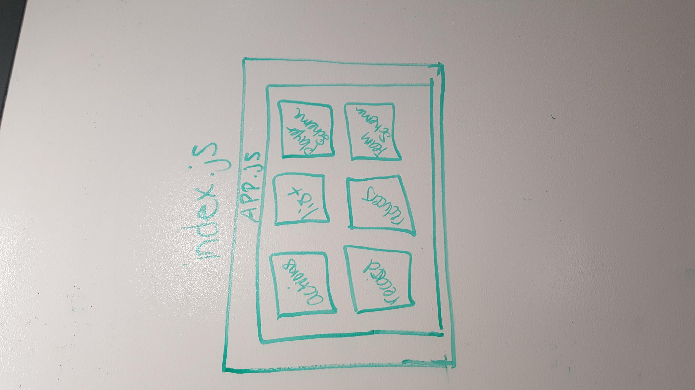

## LAB: Dynamic Forms

### Author: Siobhan Niess

## Assignment 1: Implement the RESTful Reducers

### Links and Resources
* [repo](https://codesandbox.io/s/5z15562pz4)
* [site](https://5z15562pz4.codesandbox.io/)

### Modules
* `/index.js` holds the functionality
* `public/index.html` boilerplate

##### Exported Values and Methods
* `./index.js` holds the functionality
* `src/store/index.js` holds the store reducer for the records
* `src/store/middleware/reporter.js` saying what the action is and the result for it. Also the error catch
* `components/record/actions.js` functionality to delete and post
* `components/record/list.js` functionality to delete and edit records
* `components/record/record.js` holds both schemas and handles the sumbit for each
* `components/record/reducers.js` form to update players and teams
* `components/record/players.json` schema to handle players
* `components/record/teams.json` schema to handle teams
* `components/app.js` the functionality to delete and edit a player

#### UML
